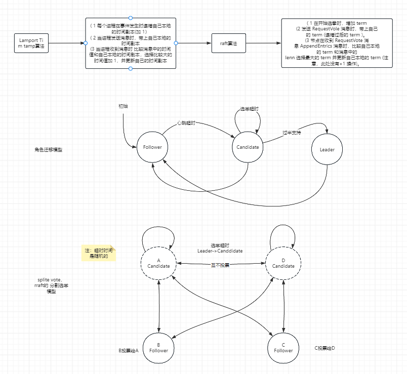

# 自己实现raft算法

目前正在研究其他raft的实现

顶层依赖

| 类库名              | 描述               |
|:-----------------|:-----------------|
| guava            | eventBus和方便的工具类  |
| protobuf-java    | 与java绑定的protobuf |
| netty-all        | netty处理器         |
| log4j-slf4j-impl | 日志               |
| commons-cli      | 命令行解析            |
| jline            | 命令行程序            |
| junit            | 测试框架             |

```xml
<?xml version="1.0" encoding="UTF-8"?>
<project xmlns="http://maven.apache.org/POM/4.0.0"
         xmlns:xsi="http://www.w3.org/2001/XMLSchema-instance"
         xsi:schemaLocation="http://maven.apache.org/POM/4.0.0 http://maven.apache.org/xsd/maven-4.0.0.xsd">
    <modelVersion>4.0.0</modelVersion>

    <groupId>com.hzh</groupId>
    <artifactId>hzh-raft</artifactId>
    <version>1.0.0-SNAPSHOT</version>
    <packaging>pom</packaging>

    <name>raft</name>

    <modules>
        <module>raft-core</module>
        <module>raft-kvstore</module>
    </modules>

    <properties>
        <maven.compiler.source>11</maven.compiler.source>
        <maven.compiler.target>11</maven.compiler.target>
        <project.build.sourceEncoding>UTF-8</project.build.sourceEncoding>
        <netty.version>4.1.96.Final</netty.version>
        <lombok.version>1.18.30</lombok.version>
        <junit.version>4.13.2</junit.version>
        <commons-lang3.version>2.6</commons-lang3.version>
        <protocol-buffer.version>3.6.0</protocol-buffer.version>
        <log4j.version>2.11.1</log4j.version>
        <commons-cli.version>1.4</commons-cli.version>
        <jline.version>3.9.0</jline.version>
    </properties>

    <dependencyManagement>
        <dependencies>
            <dependency>
                <groupId>com.google.guava</groupId>
                <artifactId>guava</artifactId>
                <version>25.1-jre</version>
                <exclusions>
                    <exclusion>
                        <groupId>org.checkerframework</groupId>
                        <artifactId>checker-qual</artifactId>
                    </exclusion>
                    <exclusion>
                        <groupId>com.google.errorprone</groupId>
                        <artifactId>error_prone_annotations</artifactId>
                    </exclusion>
                    <exclusion>
                        <groupId>com.google.j2objc</groupId>
                        <artifactId>j2objc-annotations</artifactId>
                    </exclusion>
                    <exclusion>
                        <groupId>org.codehaus.mojo</groupId>
                        <artifactId>animal-sniffer-annotations</artifactId>
                    </exclusion>
                </exclusions>
            </dependency>

            <dependency>
                <groupId>com.google.protobuf</groupId>
                <artifactId>protobuf-java</artifactId>
                <version>${protocol-buffer.version}</version>
            </dependency>

            <dependency>
                <groupId>io.netty</groupId>
                <artifactId>netty-all</artifactId>
                <version>${netty.version}</version> <!-- 根据需要选择合适的版本 -->
            </dependency>

            <dependency>
                <groupId>org.apache.logging.log4j</groupId>
                <artifactId>log4j-slf4j-impl</artifactId>
                <version>${log4j.version}</version>
            </dependency>

            <dependency>
                <groupId>commons-cli</groupId>
                <artifactId>commons-cli</artifactId>
                <version>${commons-cli.version}</version>
            </dependency>

            <!-- https://mvnrepository.com/artifact/org.jline/jline -->
            <dependency>
                <groupId>org.jline</groupId>
                <artifactId>jline</artifactId>
                <version>${jline.version}</version>
            </dependency>


            <dependency>
                <groupId>org.projectlombok</groupId>
                <artifactId>lombok</artifactId>
                <version>${lombok.version}</version>
            </dependency>

            <dependency>
                <groupId>junit</groupId>
                <artifactId>junit</artifactId>
                <version>${junit.version}</version>
                <scope>test</scope>
            </dependency>

            <dependency>
                <groupId>commons-lang</groupId>
                <artifactId>commons-lang</artifactId>
                <version>${commons-lang3.version}</version>
            </dependency>
        </dependencies>
    </dependencyManagement>

    <build>
        <pluginManagement>
            <plugins>
                <plugin>
                    <artifactId>maven-clean-plugin</artifactId>
                    <version>3.0.0</version>
                </plugin>
                <plugin>
                    <artifactId>maven-resources-plugin</artifactId>
                    <version>3.0.2</version>
                </plugin>
                <plugin>
                    <artifactId>maven-compiler-plugin</artifactId>
                    <version>3.7.0</version>
                    <configuration>
                        <source>11</source>
                        <target>11</target>
                    </configuration>
                </plugin>
                <plugin>
                    <artifactId>maven-surefile-plugin</artifactId>
                    <version>2.20.1</version>
                </plugin>
                <plugin>
                    <artifactId>maven-jar-plugin</artifactId>
                    <version>3.0.2</version>
                </plugin>
                <plugin>
                    <artifactId>maven-assembly-plugin</artifactId>
                    <version>2.6</version>
                </plugin>
            </plugins>
        </pluginManagement>
    </build>


</project>
```

**raft-core**依赖：

log4j-slf4j-impl

protobuf-java

netty-all

junit

lombok

guava

```xml
<?xml version="1.0" encoding="UTF-8"?>
<project xmlns="http://maven.apache.org/POM/4.0.0"
         xmlns:xsi="http://www.w3.org/2001/XMLSchema-instance"
         xsi:schemaLocation="http://maven.apache.org/POM/4.0.0 http://maven.apache.org/xsd/maven-4.0.0.xsd">
    <modelVersion>4.0.0</modelVersion>
    <parent>
        <groupId>com.hzh</groupId>
        <artifactId>hzh-raft</artifactId>
        <version>1.0.0-SNAPSHOT</version>
    </parent>

    <artifactId>raft-core</artifactId>
    <packaging>jar</packaging>
    <version>1.0-SNAPSHOT</version>

    <name>raft-core</name>

    <properties>
        <maven.compiler.source>11</maven.compiler.source>
        <maven.compiler.target>11</maven.compiler.target>
        <project.build.sourceEncoding>UTF-8</project.build.sourceEncoding>
    </properties>

    <dependencies>
        <dependency>
            <groupId>org.apache.logging.log4j</groupId>
            <artifactId>log4j-slf4j-impl</artifactId>
        </dependency>

        <dependency>
            <groupId>com.google.protobuf</groupId>
            <artifactId>protobuf-java</artifactId>
        </dependency>

        <dependency>
            <groupId>io.netty</groupId>
            <artifactId>netty-all</artifactId>
        </dependency>

        <dependency>
            <groupId>junit</groupId>
            <artifactId>junit</artifactId>
            <scope>test</scope>
        </dependency>

        <dependency>
            <groupId>org.projectlombok</groupId>
            <artifactId>lombok</artifactId>
        </dependency>

        <dependency>
            <groupId>com.google.guava</groupId>
            <artifactId>guava</artifactId>
        </dependency>
    </dependencies>

</project>
```

**xraft-kvstore**依赖:

raft-core

commons-cli

jline

junit

```xml
<?xml version="1.0" encoding="UTF-8"?>
<project xmlns="http://maven.apache.org/POM/4.0.0"
         xmlns:xsi="http://www.w3.org/2001/XMLSchema-instance"
         xsi:schemaLocation="http://maven.apache.org/POM/4.0.0 http://maven.apache.org/xsd/maven-4.0.0.xsd">
    <modelVersion>4.0.0</modelVersion>
    <parent>
        <groupId>com.hzh</groupId>
        <artifactId>hzh-raft</artifactId>
        <version>1.0.0-SNAPSHOT</version>
    </parent>

    <artifactId>raft-kvstore</artifactId>
    <packaging>jar</packaging>
    <version>1.0.0-SNAPSHOT</version>

    <name>xraft-kvstore</name>

    <properties>
        <maven.compiler.source>11</maven.compiler.source>
        <maven.compiler.target>11</maven.compiler.target>
        <project.build.sourceEncoding>UTF-8</project.build.sourceEncoding>
    </properties>

    <dependencies>
        <dependency>
            <groupId>com.hzh</groupId>
            <artifactId>raft-core</artifactId>
            <version>1.0-SNAPSHOT</version>
        </dependency>
        <dependency>
            <groupId>commons-cli</groupId>
            <artifactId>commons-cli</artifactId>
        </dependency>
        <dependency>
            <groupId>org.jline</groupId>
            <artifactId>jline</artifactId>
        </dependency>
        <dependency>
            <groupId>junit</groupId>
            <artifactId>junit</artifactId>
            <scope>test</scope>
        </dependency>
    </dependencies>

    <build>
        <plugins>
            <plugin>
                <groupId>org.codehaus.mojo</groupId>
                <artifactId>exec-maven-plugin</artifactId>
                <version>1.6.0</version>
            </plugin>
            <plugin>
                <artifactId>maven-assembly-plugin</artifactId>
                <configuration>
                    <descriptors>
                        <descriptor>src/assembly/bin.xml</descriptor>
                    </descriptors>
                </configuration>
            </plugin>
        </plugins>
    </build>


</project>
```

任期迁移模型：



日志复制模型:
<div>
&lt;iframe id="embed_dom" name="embed_dom" frameborder="0" style="display:block;margin-left:-244.5px; margin-top:-137.5px;width:489px; height:275px;" src="https://www.processon.com/embed/654060005c9b3802e57c03ca">
&lt;/iframe>
</div>
状态领域模型：

&lt;iframe id="embed_dom" name="embed_dom" frameborder="0" style="display:block;margin-left:-244.5px; margin-top:
-137.5px;width:489px; height:275px;" src="https://www.processon.com/embed/65406b85bc6fc631ccd9f218"&gt;&lt;/iframe>

整体线程设计：

&lt;iframe id="embed_dom" name="embed_dom" frameborder="0" style="display:block;margin-left:-244.5px; margin-top:
-137.5px;width:489px; height:275px;" src="https://www.processon.com/embed/65408a803458d424197fed3c"&gt;&lt;/iframe>

定时器组件领域模型：

&lt;iframe id="embed_dom" name="embed_dom" frameborder="0" style="display:block;margin-left:-244.5px; margin-top:
-137.5px;width:489px; height:275px;" src="https://www.processon.com/embed/6541d8653458d42419813c8f"&gt;&lt;/iframe>

消息建模：

&lt;iframe id="embed_dom" name="embed_dom" frameborder="0" style="display:block;margin-left:-244.5px; margin-top:
-137.5px;width:489px; height:275px;" src="https://www.processon.com/embed/6541e7a714498b3bdf62b095"&gt;&lt;/iframe>

一致性核心组件：

&lt;iframe id="embed_dom" name="embed_dom" frameborder="0" style="display:block;margin-left:-244.5px; margin-top:
-137.5px;width:489px; height:275px;" src="https://www.processon.com/embed/6541f318bc4d97719889127e"&gt;&lt;/iframe>

关联组件核心模型：

&lt;iframe id="embed_dom" name="embed_dom" frameborder="0" style="display:block;margin-left:-244.5px; margin-top:
-137.5px;width:489px; height:275px;" src="https://www.processon.com/embed/6541e988ade4841ca5f7ac44"&gt;&lt;/iframe>

日志文件领域模型：

&lt;iframe id="embed_dom" name="embed_dom" frameborder="0" style="display:block;margin-left:-244.5px; margin-top:
-137.5px;width:489px; height:275px;" src="https://www.processon.com/embed/6545e7b47aa468729679ff88"&gt;&lt;/iframe>

日志的领域模型：

&lt;iframe id="embed_dom" name="embed_dom" frameborder="0" style="display:block;margin-left:-244.5px; margin-top:
-137.5px;width:489px; height:275px;" src="https://www.processon.com/embed/6545d360b2286f77510462b4"&gt;&lt;/iframe>

注意点：
我今天在编写测试代码的时候发现在使用proto文件生成类的时候发现会有报错，具体的原因是因为
os上的protobuf的版本与maven依赖的版本对应不上，所以这一点需要注意：解决方式：

~~~shell
proto --version
# 输出的如果是24.4，后面的4.4就是你的maven要对应的版本
~~~

~~~xml

<dependency>
    <groupId>com.google.protobuf</groupId>
    <artifactId>protobuf-java</artifactId>
    <version>3.24.4</version>
</dependency>
~~~  
